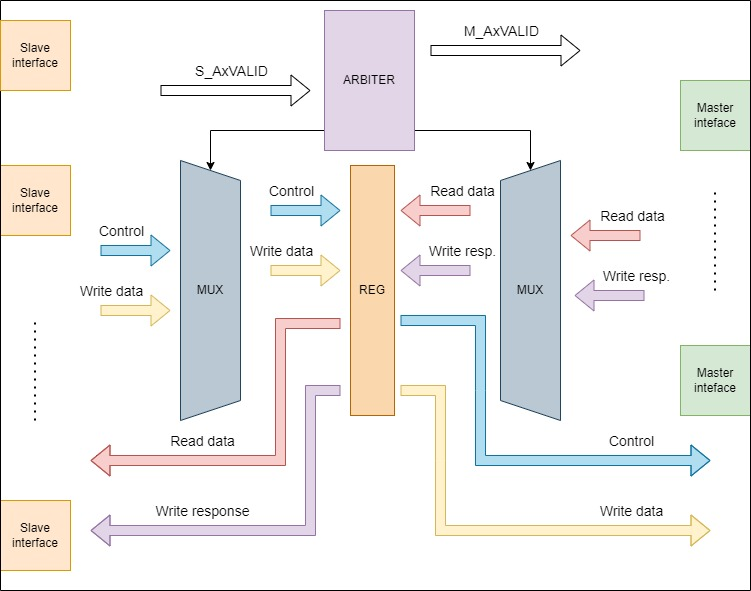
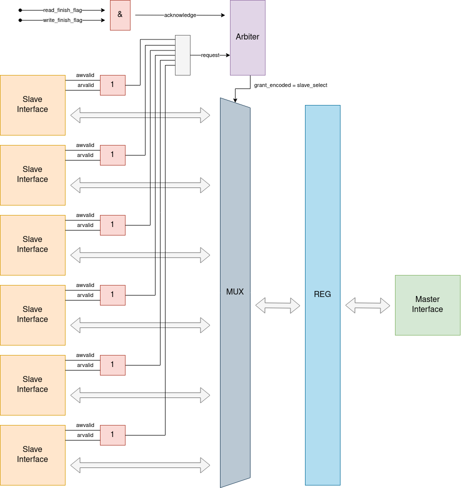

# AXI Many-To-One Interconnect

## Описание

Коммутатор интерфейсов AXI4, изначально проектировавшийся как коммутатор 6-Master к 1-Slave. Благодаря параметризации теоретически возможно любое количество подключений интерфейсов типа Master. Основная конфигурация, тем не менее, предполагает наличие только одного Slave.

Порядок доступа Master к Slave определяется при помощи арбитра. Арбитр принимает на вход сигналы запросов и выдает разрешение одному из них. В роли запроса здесь выступают сигналы AxVALID, поступающие от внутренних Slave интерфейсов (то есть, от Master, находящихся снаружи модуля). Разрешение, выданное арбитром, выражается в единственном сигнале AxVALID, поступающем на внутренний ведущий интерфейс и, таким образом, доходящем до внешнего ведомого интерфейса, что, в свою очередь, запускает транзакцию.

Ориентируясь на выданное разрешение и на номер внутреннего ведомого интерфейса, которому оно выдано, прочие сигналы с обеих сторон мультиплексируются и поступают во внутренний регистровый файл, из которого уже перенаправляются на свои выходные интерфейсы. Модуль спроектирован как конечный автомат, где одновременно может выполняться только одна операция чтения либо записи, каждая из которых разделена на стадии-состояния автомата. Состояния включат в себя ожидание, декодирование участвующих в транзакции интерфейсов при помощи арбитра, передачу данных (запись либо чтение), сброс данных в случае ошибки, завершение транзакции.

Схема потока данных в модуле приведена на рисунке @fig:Data_flow.

{#fig:Data_flow}

Стоит обратить внимание, что указанный на схеме регистровый файл не отображает реального количества регистровых задержек в модуле.

## Конструкция

На рисунке @fig:Optimization_schematic представлен общий вид конструкции модуля.

{#fig:Optimization_schematic}

Единственный ведомый интерфейс нивелирует необходимость в каком-либо функционале проверки адресов, что, в свою очередь, дает возможность быстро производить одновременные транзакции чтения и записи для одного и того же ведущего интерфейса. Исходя из предположения, что такие одновременные транзакции допустимы в конструкции, будем производить запуск арбитража по любому из сигналов, оповещающих о готовности начать транзакцию, т.е., AxVALID. После того, как арбитр выдаст разрешение одному из входных ведомых интерфейсов, будет запущено мультиплексирование с учетом номера, полученного у арбитра.

Предусмотрена возможность мультитранзакций. Если во время уже запущенной транзакции чтения либо записи со стороны внутреннего ведомого интерфейса приходит запрос на начало еще одной транзакции, то он будет удовлетворен, в том случае, если идентификатор AXI ID новой транзакции совпадает с таковым у уже запущенной транзакции. Тогда информация о вновь прибывшей передаче будет передана по каналу адреса еще до окончания предыдущей, и коммутатор не станет закрывать соединение до тех пор, пока эта передача также не завершится. Тем не менее, стоит учитывать случай, в котором AXI ID не используется ведущей стороной, т.к. такой вариант также допустим в стандарте AXI. В таком случае от мультитранзакций приходится отказаться и выделять внешнему ведущему интерфейсу линии передачи данных только на одну транзакцию при каждом цикле арбитража. Все вышеперечисленное приводит нас к необходимости параметризации устройства.

Так как транзакции чтения и записи от одного и того же инициатора проходят одновременно, если ему выдано разрешение арбитром, необходим механизм фиксации факта завершения всех начатых транзакций, который сигнализирует арбитру, что интерфейс-инициатор завершил работу с линиями передачи данных, и разрешение может быть у него отозвано. Такой механизм в предлагаемой конструкции состоит из набора счетчиков и флагов. Двумя основными флагами, сообщающими арбитру о завершении всех транзакций, являются флаг окончания записи write_finish_flag и флаг завершения чтения read_finish_flag. Режим выставления данных флагов зависит от того, собрано ли устройство в режиме мультитранзакций.

В случае работы в режиме мультитранзакций, выставление каждого из вышеописанных флагов зависит от двух счетчиков - счетчика заявленных транзакций и счетчика завершенных транзакций. Счетчик заявленных транзакций инкрементируется каждый раз, когда по каналу адреса передаются контрольные данные для очередной транзакции. Счетчик завершенных транзакций инкрементируется каждый раз, когда по каналу подтверждения (в случае транзакции записи) либо по каналу передачи данных (в случае транзакции чтения) проходит подтверждение окончания передачи. Когда значения этих счетчиков сравняются, а на входе канала адреса не будет новой транзакции, будет выставлен соответствующий флаг завершения, а прием новых транзакций будет заблокирован. Таким образом, в конфигурации мультитранзакций флаги завершения зависят от 4 счетчиков:

1. write_declared_transaction_counter - счетчик заявленных транзакций записи;
2. write_completed_transaction_counter - счетчик завершенных транзакций записи;
3. read_declared_transaction_counter - счетчик заявленных транзакций чтения;
4. read_completed_transaction_counter - счетчик завершенных транзакций чтения.

В случае работы в режиме без мультитранзакций, используется условный приоритет транзакций чтения над транзакциями записи. Если арбитраж был вызван транзакцией чтения либо транзакциями чтения и записи одновременно, то на время, пока идет транзакция чтения, линии транзакций записи могут работать в режиме мультитранзакций, но как только транзакция чтения завершится, прием новых транзакций записи прекращается. В случае, когда арбитраж вызван исключительно транзакцией записи, этот принцип работает в обратную сторону. В любом случае, если основная транзакция всегда одна, то вспомогательных транзакций может быть несколько. Для их регулирования используется пара счетчиков по принципу, аналогичному обозначенному выше для режима мультитранзакций:

1. declared_transaction_counter - счетчик заявленных вспомогательных транзакций;
2. completed_transaction_counter - счетчик завершенных вспомогательных транзакций.

Равенство значений данных счетчиков индуцирует выставление флага завершения того типа транзакций, который считается основным в рамках текущей передачи. Основная транзакция может быть только одна, поэтому соответствующий флаг выставляется сразу после ее завершения.

Для быстрой работы и гарантированной доставки данных в предлагаемой конструкции предусмотрен один регистровый слой, который проходят данные. Данный срез необходим на случай, если принимающая данные сторона окажется не готова к очередному пакету и не выставит сигнал READY. Тогда данные будут задержаны внутри коммутатора, и передача возобновится на следующий такт после выставления приемной стороной сигнала READY.

Регулировка режимов работы устройства осуществляется при помощи конечного автомата, включающего три состояния:

1. состояние покоя ST_IDLE - транзакции не осуществляются, разрешений передачи нет ни у кого из внешних ведущих интерфейсов, арбитраж осуществляется. Как только арбитр выдаст разрешение одному из инициаторов транзакций, автомат перейдет в следующее состояние;
2. состояние передачи ST_TRANSACTION - транзакции осуществляет интерфейс, получивший разрешение в результате арбитража, занимая линии передачи данных. Переход в следующее состояние происходит, когда выставлены оба флага завершения;
3. состояние завершения ST_FINISH - происходит сброс счетчиков и флагов, блокируется доступ к линиям данных, возобновляется арбитраж. Состояние длится один такт, после чего происходит переход в состояние покоя.

