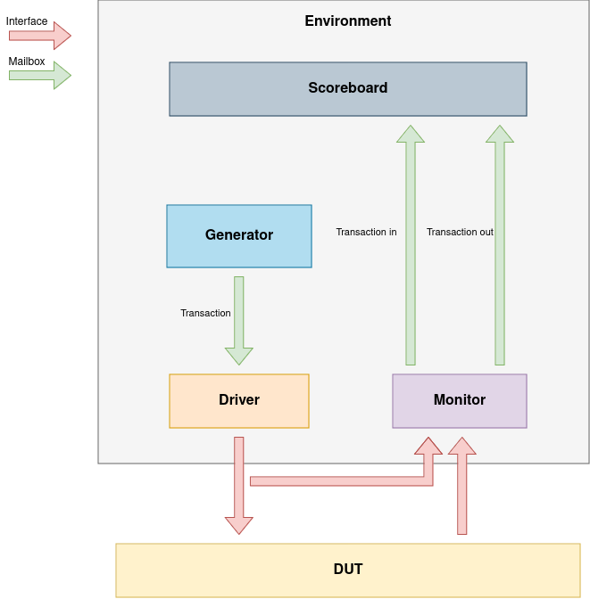

# Test Base Package

## Description

The purpose of this package is to offer a basic set of classes for a usual Testbench. It does not aim to be universal, more like suitable for most small and medium designs.

Package provides base classes for Generator, Driver, Monitor, Scoreboard, Environment and Test. Below is the visual representation of how this works.

- Generator generates (surprise!) transactions and sends them to the Driver;
- Driver collects the transactions and drives them into DUT's interface;
- Monitor gathers data from both inputs and outputs of DUT's interface, makes them into transactions and sends to the Scoreboard;
- Scoreboard uses a reference model to get the expected data basing on the input transaction, and compares that to the actual data.
- Environment encapsulates objects of all the previous classes, connects them and makes them run altogether;
- Test is a container for an Environment object(s).

Basic workflow is defined already, all one needs to do is
1. Implement Transaction class;
2. Implement certain tasks which can't be implemented in base classes, cuz they depend on DUT interface data format.

You'll see that the classes are type parametrized. BaseGenerator, BaseDriver, BaseMonitor, and BaseScoreboard use T parameter. This one is meant to hold your own Transaction class, once you implement it. BaseEnvironment uses G, D, M, S parameters, which stand for Generator, Driver, Monitor, Scoreboard types. Once you implement child classes for base versions of those, substitute G, D, M, S with their types. Same thing goes for BaseTest and E parameter (Environment type).

This version isn't invariant in any way. It can be modified as one's wishes to suit their needs and/or correct any mistakes.

## Usage and examples

The package itself is defined in `test_base.sv` file. A usage example is provided - `test_bit_expand_counter.sv` contains testbench for a simple module `bit_expand_counter`, which is defined in corresponding `.v` file.
